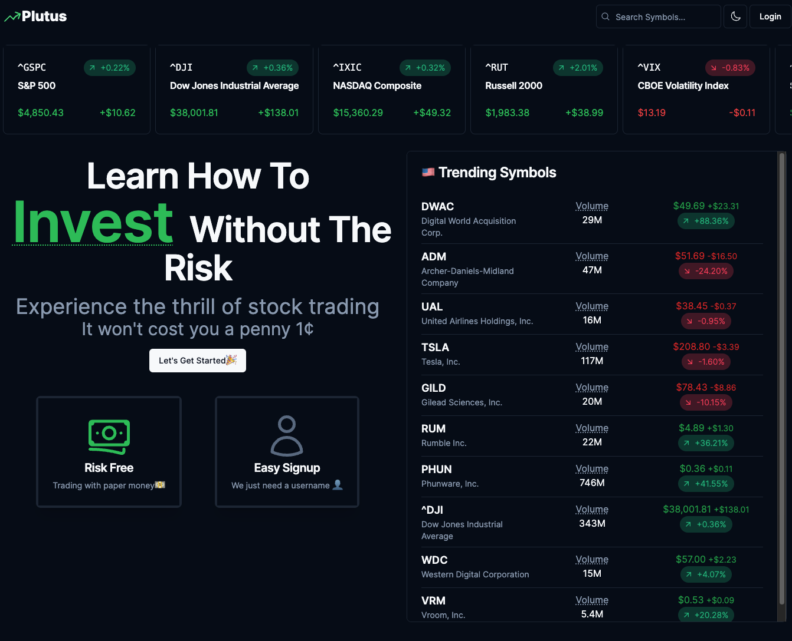

<p align='center'>
    
</p>
<h1 align='center'>Plutus</h1>
<p align='center'>
    <em>Stock Market Simulator 📈</em>
</p>
<p align='center'>
    
    
</p>

---

## Overview 📍

[Plutus](https://plutus-trading.vercel.app) provides a platform for users to experience and learn more about stock trading. User can gain practical insights into the dynamics of the stock market.

## Screenshots 📸



## Features ✨

- 🌓 DarkMode
- 👤 Easy Account Creation
- 💰 Buy and Sell Stock (In Real Time Price)
- 👀 Custom Watch List
- 📰 Latest Market News
- 📈 Stock Chart With Different Time Intervals
- ⌨️ Stock Symbol Autocomplete
- [WIP] Stock Options & Financial Data

## Development ⚙️

To get started, you can clone the repository or

```
git clone https://github.com/Kelvin-Hui/Plutus.git
```

or download a [zip archive](https://github.com/Kelvin-Hui/plutus/archive/main.zip)

Before you start

> [!NOTE]
>
> Remember to set up your `postgres` database and save it to your `.env` file (Along With an `AUTH_SECRET` for authentications)

### For Development Mode

```
npm install
npm run dev
```

### Building and Run In Production Mode

```
npm install
npm run build
npm run start
```
